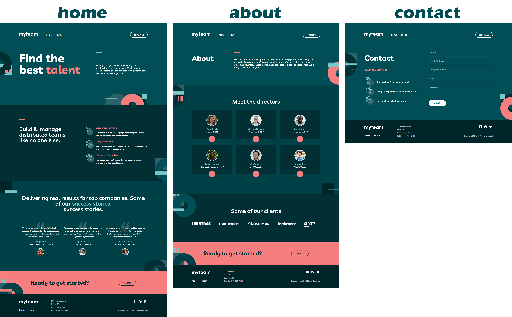
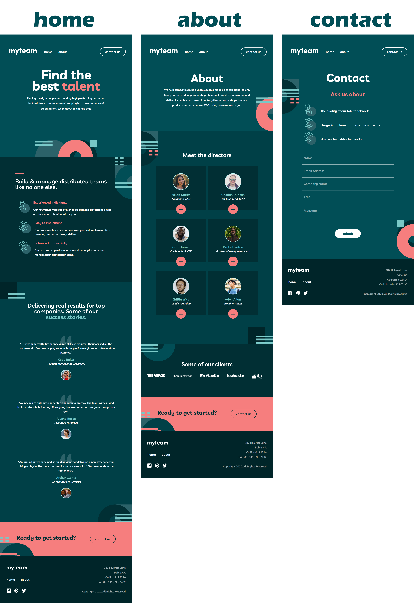
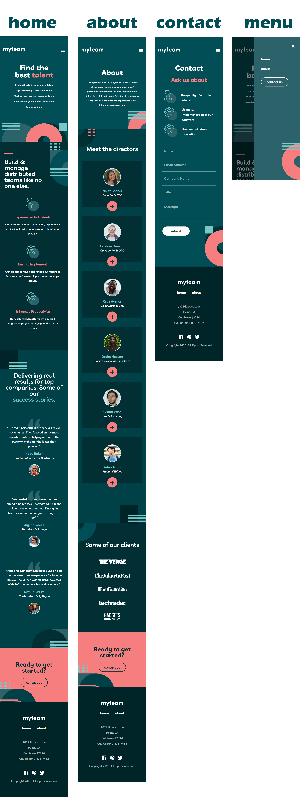

## Table of contents

- [Overview](#overview)
  - [The challenge](#the-challenge)
  - [Screenshot](#screenshot)
  - [Links](#links)
- [My process](#my-process)
  - [Built with](#built-with)
  - [Continued development](#continued-development)

## Overview

### The challenge

Users should be able to:

- View the optimal layout for each page depending on their device's screen size
- See hover states for all interactive elements throughout the site
- See the correct content for each team member on the About page when the `+` icon is clicked

### Screenshots
## DESKTOP SITE

## TABLET SITE

## MOBILE SITE

### Links

- Live Site URL: [Click Here!](https://myteam-virid.vercel.app/)

### Built with

- Semantic HTML5 markup
- CSS
- Javascript
- Mobile-first workflow

### If I had more time on this project what would I improve and why?

I would fix the unwanted box highlighting on my card buttons on mobile.  
I would also trim down my css and organize all of the code better,   
as well as fix some naming conventions on classes I made in a hurry.  
I think that the background elements would look nice with a little bit of animation too!  
I also need to check for layout / font-size problems when gradually stepping down between target resolutions.

